<!-- ============================================================
     HIMANSHU YADAV — GitHub Profile README
     Built with precision. Designed with intent.
     ============================================================ -->

<!-- ─────────────────────────────────────────────────────────────
     SECTION 1 · HERO BANNER
     ───────────────────────────────────────────────────────────── -->
<div align="center">



</div>

<br/>

<!-- ─────────────────────────────────────────────────────────────
     SECTION 2 · INTRODUCTION
     ───────────────────────────────────────────────────────────── -->
<div align="center">

I'm a Computer Science student at **VIT Bhopal** with a strong foundation in full stack development, backend engineering, and cloud infrastructure. I build systems that are reliable, scalable, and maintainable — not just things that work, but things that work well under pressure.

My approach is grounded in competitive programming and systems thinking. I've solved **1000+ problems** across LeetCode, Codeforces, and GeeksforGeeks, which shapes how I reason about performance, edge cases, and algorithmic design in production code.

Currently focused on backend architecture, distributed systems, and cloud-native development. I'm actively contributing to open source and exploring the intersection of AI with practical software systems.

</div>

<br/>


<br/>

<!-- ─────────────────────────────────────────────────────────────
     SECTION 3 · TERMINAL CARD
     ───────────────────────────────────────────────────────────── -->

<div align="center">



</div>

<br/>


<br/>

<!-- ─────────────────────────────────────────────────────────────
     SECTION 4 · PROFESSIONAL DASHBOARD
     ───────────────────────────────────────────────────────────── -->

<h2 align="center">
  &nbsp;
  Dashboard
</h2>

<div align="center">

<table>
<tr>
<td align="center" width="160">
  <h3>1+</h3>
  <sub><code>Years Experience</code></sub>
</td>
<td align="center" width="160">
  <h3>3+</h3>
  <sub><code>Production Projects</code></sub>
</td>
<td align="center" width="160">
  <h3>1000+</h3>
  <sub><code>Problems Solved</code></sub>
</td>
<td align="center" width="160">
  <h3>9.21</h3>
  <sub><code>GPA (10.0 Scale)</code></sub>
</td>
</tr>
<tr>
<td align="center" width="160">
  <h3>1800</h3>
  <sub><code>LeetCode Rating</code></sub>
</td>
<td align="center" width="160">
  <h3>1000</h3>
  <sub><code>Codeforces Rating</code></sub>
</td>
<td align="center" width="160">
  <h3>5+</h3>
  <sub><code>Certifications</code></sub>
</td>
<td align="center" width="160">
  <h3>15+</h3>
  <sub><code>React Components Built</code></sub>
</td>
</tr>
</table>

</div>

<br/>


<br/>

<!-- ─────────────────────────────────────────────────────────────
     SECTION 5 · TECH STACK
     ───────────────────────────────────────────────────────────── -->

<h2 align="center">
  ⚙️&nbsp; Tech Stack
</h2>

<br/>

<div align="center">

**Languages**

[](https://skillicons.dev)

<br/>

**Frontend**

[](https://skillicons.dev)

<br/>

**Backend & Cloud**

[](https://skillicons.dev)

<br/>

**AI & Data Science**

[](https://skillicons.dev)

<br/>

**Tools & Platforms**

[](https://skillicons.dev)

</div>

<br/>

<div align="center">

| Area | Technologies |
|------|-------------|
| **Languages** | Python · C++ · Java · JavaScript · TypeScript |
| **Frontend** | React.js · HTML5 · CSS3 · Tailwind CSS · DOM APIs |
| **Backend** | Firebase · REST APIs · Node.js |
| **Cloud** | AWS EC2 · S3 · IAM · Lambda · API Gateway · CloudWatch · Azure AI |
| **AI / ML** | TensorFlow · Scikit-learn · CNN · Azure AI Services |
| **Databases** | Firestore · Firebase Realtime Database |
| **Tools** | Git · GitHub · Vite · VS Code |
| **Concepts** | DSA · OOP · System Design · Microservices (learning) |

</div>

<br/>


<br/>

<!-- ─────────────────────────────────────────────────────────────
     SECTION 6 · WORK EXPERIENCE
     ───────────────────────────────────────────────────────────── -->

<h2 align="center">
  💼&nbsp; Experience
</h2>

<br/>

<table width="100%">
<tr>
<td width="50%" valign="top">

### 🔵 AI Ally
**Frontend Web & AI Developer Intern**
`Jun 2025 – Oct 2025` · Remote

- Built **15+ reusable React.js components** with fully responsive UI architecture
- Integrated **5+ Azure AI capabilities** into frontend workflows
- Delivered across **3+ production-ready web modules** in an Agile environment
- Supported development, debugging, testing, and deployment activities

**Stack:** React.js · Azure AI · Agile · Responsive Design

</td>
<td width="50%" valign="top">

### 🟢 ServiceNow
**Virtual Internship**
`May 2026 – Jun 2026`

- Completed **11 training modules** and earned **12 badges** in enterprise workflow automation
- Expertise in ITSM and low-code application development
- Configured **5+ automated workflows** on a cloud-based enterprise platform
- Received industry-expert training throughout the full program

**Stack:** ServiceNow · ITSM · Workflow Automation · Low-Code Dev

</td>
</tr>
</table>

<br/>


<br/>

<!-- ─────────────────────────────────────────────────────────────
     SECTION 7 · FEATURED PROJECTS
     ───────────────────────────────────────────────────────────── -->

<h2 align="center">
  🗂️&nbsp; Featured Projects
</h2>

<br/>

<!-- Project 1: SyncSheet -->
<details open>
<summary><b>&nbsp;📊 SyncSheet — Real-Time Collaborative Spreadsheet</b></summary>
<br/>

<div align="left">

> A Google Sheets–inspired collaborative platform with real-time multi-user editing, a custom formula engine, and Firebase-backed presence tracking.

**Architecture Highlights**



<br/>

| Aspect | Detail |
|--------|--------|
| **Real-time Sync** | Firestore listeners with optimistic UI synchronization |
| **Formula Engine** | Custom TypeScript engine — SUM, AVERAGE, arithmetic, cell-reference resolution |
| **Grid** | 26×30 responsive spreadsheet with keyboard navigation |
| **Auth** | Firebase Auth with Google OAuth |
| **Presence** | Realtime DB–based collaborator presence tracking |

**Tech Stack**

```
React  ·  TypeScript  ·  Firebase (Firestore, Auth, Realtime DB)  ·  Tailwind CSS
```

[](https://github.com/himanshuydv07/syncsheet)
[](https://himanshuyadav-chi.vercel.app/)

</div>
</details>

<br/>

<!-- Project 2: Cinematics Weather -->
<details>
<summary><b>&nbsp;🌦️ Cinematics Weather — Cinematic Weather Visualization App</b></summary>
<br/>

<div align="left">

> A weather app that delivers dynamic, location-aware weather insights with immersive cinematic visuals. No external animation libraries — pure CSS keyframes and DOM particles.

| Aspect | Detail |
|--------|--------|
| **APIs** | OpenWeatherMap + Unsplash — dynamic weather + contextual visuals |
| **Animations** | CSS keyframes + DOM-generated particles (zero external deps) |
| **Architecture** | Async JS with efficient multi-API orchestration |
| **Design** | Fully responsive across all screen sizes |
| **Performance** | Optimized asynchronous API handling |

**Tech Stack**

```
HTML5  ·  CSS3  ·  JavaScript (ES6+)  ·  OpenWeatherMap API  ·  Unsplash API
```

[](https://github.com/himanshuydv07)
[](https://himanshuyadav-chi.vercel.app/)

</div>
</details>

<br/>

<!-- Project 3: Digital Forensics -->
<details>
<summary><b>&nbsp;🔍 Digital Forensic Framework — Steganography Detection with CNN</b></summary>
<br/>

<div align="left">

> A CNN-powered forensic framework to detect hidden steganographic content in digital images, with an 88% accuracy web-based prediction interface.

| Aspect | Detail |
|--------|--------|
| **Model** | Convolutional Neural Network (CNN) for binary classification |
| **Accuracy** | **88%** through dataset diversification and iterative model tuning |
| **Interface** | Web-based upload + real-time probability-driven classification |
| **Training** | Dataset diversification + model optimization for performance gains |
| **Stack** | Python deep learning pipeline + web frontend |

**Tech Stack**

```
Python  ·  CNN  ·  TensorFlow  ·  HTML  ·  CSS  ·  JavaScript
```

[](https://github.com/himanshuydv07)

</div>
</details>

<br/>


<br/>

<!-- ─────────────────────────────────────────────────────────────
     SECTION 8 · ENGINEERING PRINCIPLES
     ───────────────────────────────────────────────────────────── -->

<h2 align="center">
  🧭&nbsp; Engineering Principles
</h2>

<br/>

<div align="center">

| Principle | What it means to me |
|-----------|---------------------|
| **Clean Architecture** | Separate concerns, keep layers independent, make the codebase navigable by anyone |
| **Scalable Systems** | Design for 10x before you need it — structure beats scramble |
| **API Design** | Contracts are promises; design them deliberately, version them carefully |
| **Performance** | Measure before optimizing; eliminate allocations, not just lines |
| **Security** | Least privilege, validate at every boundary, never trust the client |
| **Developer Experience** | If it's hard to run locally, it'll be hard to maintain in production |

</div>

<br/>


<br/>

<!-- ─────────────────────────────────────────────────────────────
     SECTION 9 · COMPETITIVE PROGRAMMING
     ───────────────────────────────────────────────────────────── -->

<h2 align="center">
  🧠&nbsp; Competitive Programming
</h2>

<br/>

<div align="center">

<table>
<tr>
<td align="center" width="25%">

**LeetCode**


`350+ Problems Solved`

[](https://leetcode.com/u/cWv1Md4JO4/)

</td>
<td align="center" width="25%">

**Codeforces**


`300+ Problems Solved`

[](https://codeforces.com/profile/Himanshu_ydv__)

</td>
<td align="center" width="25%">

**GeeksforGeeks**


`350+ Problems Solved`

[](https://www.geeksforgeeks.org/profile/himanshuhuoo)

</td>
<td align="center" width="25%">

**Total**


`Across all platforms`

`DSA · Graphs · DP · Trees`

</td>
</tr>
</table>

</div>

<br/>

<!-- LeetCode Stats Card -->
<div align="center">


</div>

<br/>


<br/>

<!-- ─────────────────────────────────────────────────────────────
     SECTION 10 · GITHUB ANALYTICS
     ───────────────────────────────────────────────────────────── -->

<h2 align="center">
  📈&nbsp; GitHub Analytics
</h2>

<br/>

<div align="center">


&nbsp;


</div>

<br/>

<!-- GitHub Streak -->
<div align="center">


</div>

<br/>

<!-- Activity Graph -->
<div align="center">


</div>

<br/>

<!-- Snake animation — generated by the snake.yml workflow -->
<div align="center">

<picture>
  <source media="(prefers-color-scheme: dark)"
    srcset="https://raw.githubusercontent.com/himanshuydv07/himanshuydv07/output/github-contribution-grid-snake-dark.svg"/>
  <source media="(prefers-color-scheme: light)"
    srcset="https://raw.githubusercontent.com/himanshuydv07/himanshuydv07/output/github-contribution-grid-snake.svg"/>
  
</picture>

</div>

<br/>


<br/>

<!-- ─────────────────────────────────────────────────────────────
     SECTION 11 · ACHIEVEMENTS
     ───────────────────────────────────────────────────────────── -->

<h2 align="center">
  🏆&nbsp; Achievements
</h2>

<br/>

<div align="center">

<table>
<tr>
<td align="center" width="20%">
  <h3>🧩</h3>
  <b>1000+</b><br/>
  <sub>Problems Solved</sub>
</td>
<td align="center" width="20%">
  <h3>⭐</h3>
  <b>1800</b><br/>
  <sub>LeetCode Rating</sub>
</td>
<td align="center" width="20%">
  <h3>🎯</h3>
  <b>1000</b><br/>
  <sub>Codeforces Rating</sub>
</td>
<td align="center" width="20%">
  <h3>🎓</h3>
  <b>9.21 GPA</b><br/>
  <sub>VIT Bhopal (10.0)</sub>
</td>
<td align="center" width="20%">
  <h3>🏅</h3>
  <b>12 Badges</b><br/>
  <sub>ServiceNow Certified</sub>
</td>
</tr>
<tr>
<td align="center" width="20%">
  <h3>☁️</h3>
  <b>AWS</b><br/>
  <sub>Technical Essentials</sub>
</td>
<td align="center" width="20%">
  <h3>🤝</h3>
  <b>500+</b><br/>
  <sub>Hackathon Participants Led</sub>
</td>
<td align="center" width="20%">
  <h3>🧱</h3>
  <b>15+</b><br/>
  <sub>React Components Shipped</sub>
</td>
<td align="center" width="20%">
  <h3>🌐</h3>
  <b>5+</b><br/>
  <sub>Azure AI Integrations</sub>
</td>
<td align="center" width="20%">
  <h3>📦</h3>
  <b>3+</b><br/>
  <sub>Production Modules</sub>
</td>
</tr>
</table>

</div>

<br/>


<br/>

<!-- ─────────────────────────────────────────────────────────────
     SECTION 12 · CERTIFICATIONS
     ───────────────────────────────────────────────────────────── -->

<h2 align="center">
  📜&nbsp; Certifications
</h2>

<br/>

<div align="center">

| Certification | Issued By | Badge |
|---------------|-----------|-------|
| **AWS Technical Essentials** | Amazon Web Services |  |
| **Blockchain and Its Applications** | NPTEL · IIT Kharagpur |  |
| **Bits and Bytes of Computer Networking** | Coursera · Google |  |
| **Python (Basics)** | HackerRank |  |
| **React (Basics)** | HackerRank |  |
| **Software Engineer** | HackerRank |  |
| **ServiceNow VIP Certificate** | ServiceNow |  |

</div>

<br/>


<br/>

<!-- ─────────────────────────────────────────────────────────────
     SECTION 13 · CURRENT FOCUS
     ───────────────────────────────────────────────────────────── -->

<h2 align="center">
  🎯&nbsp; Current Focus
</h2>

<br/>

<div align="center">

```text
🏗️  Building scalable backend systems with clean architecture
☸️  Learning Kubernetes and container orchestration
🧠  Exploring AI systems and LLM integration patterns
🌐  Deepening AWS expertise — serverless and infrastructure
🤝  Contributing to open source projects
📐  Mastering system design fundamentals
```

</div>

<br/>


<br/>

<!-- ─────────────────────────────────────────────────────────────
     SECTION 14 · ROADMAP 2026
     ───────────────────────────────────────────────────────────── -->

<h2 align="center">
  🗺️&nbsp; Roadmap 2026
</h2>

<br/>

<div align="center">

| Quarter | Focus Area | Goal |
|---------|-----------|------|
| **Q1** | Backend Engineering | Build a production-grade REST API with Postgres + Redis caching |
| **Q2** | Cloud & Infrastructure | AWS Solutions Architect Associate certification |
| **Q3** | Distributed Systems | Study and implement consistent hashing, service discovery |
| **Q4** | AI Engineering | Integrate LLM APIs into a production project |
| **Ongoing** | Open Source | Regular contributions to meaningful OSS projects |
| **Ongoing** | Competitive Programming | Reach 2000+ on LeetCode, 1200+ on Codeforces |

</div>

<br/>


<br/>

<!-- ─────────────────────────────────────────────────────────────
     SECTION 15 · CONNECT
     ───────────────────────────────────────────────────────────── -->

<h2 align="center">
  🔗&nbsp; Connect
</h2>

<br/>

<div align="center">

[](https://github.com/himanshuydv07)

[](https://www.linkedin.com/in/himanshu-ydv04/)

[](https://himanshuyadav-chi.vercel.app/)

[](https://leetcode.com/u/cWv1Md4JO4/)

[](https://codeforces.com/profile/Himanshu_ydv__)

[](https://www.geeksforgeeks.org/profile/himanshuhuoo)

[](mailto:himanshuydv0007@gmail.com)

</div>

<br/>


<br/>

<!-- ─────────────────────────────────────────────────────────────
     SECTION 16 · FOOTER
     ───────────────────────────────────────────────────────────── -->

<div align="center">


<br/>

<sub>
  Built with precision · Designed with intent · Powered by curiosity
</sub>

<br/><br/>

<sub>
  
</sub>

</div>
